AIMS GUI Walkthrough
=====
The AIMS analysis pipeline has been used to analyze a wide range of molecular species, including TCRs, antibodies, MHC molecules, MHC-like molecules, MHC-presented peptides, viral protein alignments, and evolutionarily conserved neuronal proteins. The GUI is currently only capable of analyzing these first four molecular species, with more analysis options hopefully available in the future.

This section will provide a step-by-step walkthrough outlining how to use the AIMS Graphical User Interface (GUI) through screenshots of the app. The focus will be primarily on how to interface with the GUI, how files are saved when using the GUI, and tips and tricks for a smooth AIMS experience. Before starting the GUI, you may want to check out the :doc:`AIMS_basics` and review the :ref:`formatting` and :ref:`core`.

When launching the GUI, this screen should be the first thing that you see:

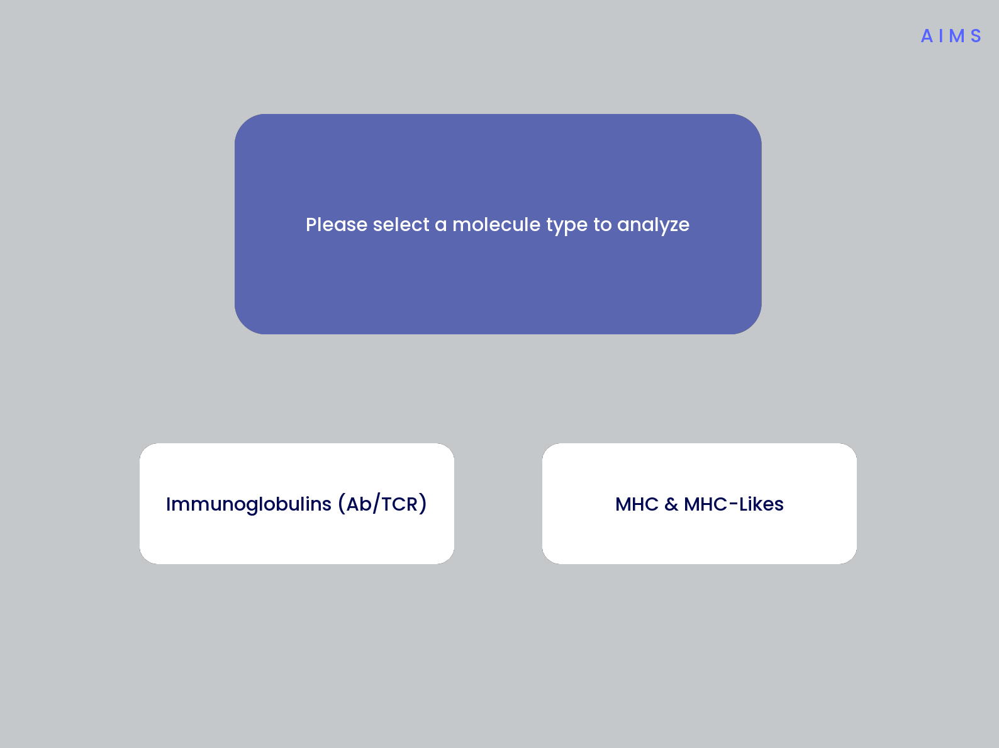

The navigation through the AIMS GUI is linear and button-based, allowing users to simply click through all of the analysis. If you'd like to analyze antibody (Ab) or T cell receptor (TCR) sequences, start with the :ref:`AIMSig` section. If you'd like to analyze MHC and MHC-like molecules, skip down to the :ref:`AIMSmhc` section.

.. _AIMSig:

Immunoglobulin Analysis with AIMS
------------
This section is specifically for the analysis of T cell receptors and antibodies. The analysis and formatting are identical for each of these receptor types, and one could even analyze these receptor types simultaneously, if for some reason one wanted to.

**Step 1: Loading in Data**

Assuming the input data is already properly formatted, everything should easily flow through the GUI and generate all data required. The first screen after selecting the Ig analysis should look like the first panel in the below image:

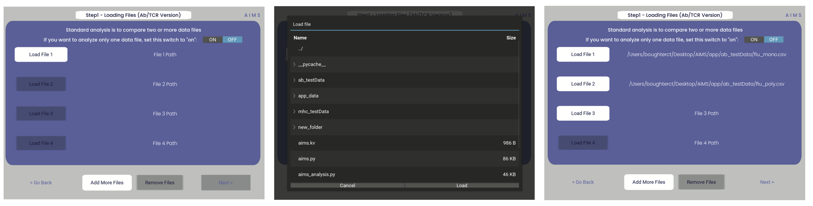

Once you click one of those light gray “Load File” buttons, you should get a screen that looks like the image in the second panel. From this, you can click through your directories and select the file you want to load in. If the file has been properly loaded, the File Path should be updated to reflect the file location.

.. note::
   If following along with this walkthrough, select the "ab_testData" directory and load in flu_mono.csv and flu_poly.csv

If you would like to analyze only one dataset using AIMS, change the "ON/OFF" switch in the top right-hand corner to "ON". Otherwise, the AIMS GUI will require at least two datasets to be loaded into the analysis. Additionally, if the data of interest is spread across more than four files, click the "add more files" option to increase the number of file slots on the screen. As of AIMS_0.5.5, a max of 9 files may be analyzed at once.

**Step 2: Define Names and Outputs**

In this step, we define the folder which the outputs are saved to, the labels that will accompany the datasets in figure legens, and the number of CDR loops in the input data. Further, the AIMS GUI removes expanded clones and sequence duplicates by default. Uncheck the box if you'd like to include degenerate receptors.

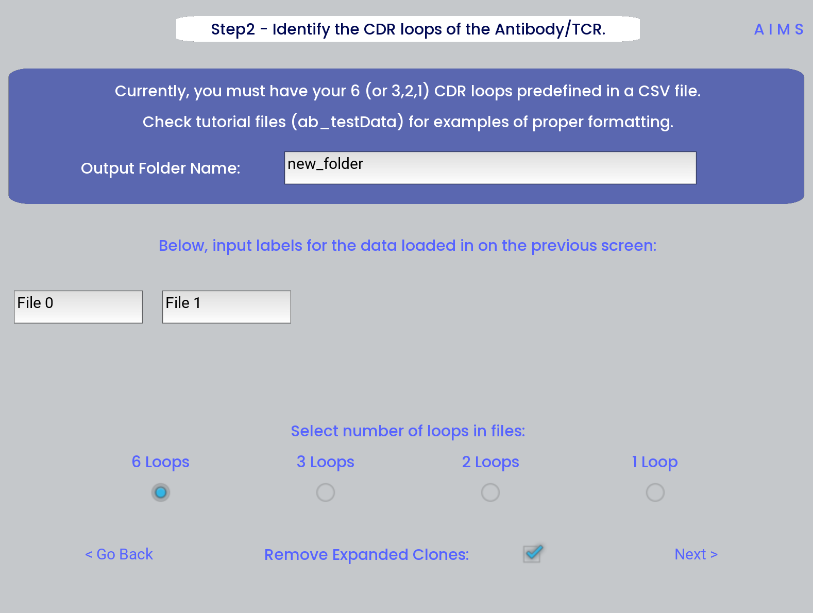

.. warning::
   Defining the output directory is very important, as by default files are overwritten if the analysis is run multiple times. Ideally each new run of AIMS should be output to a new directory, with a descriptive title.

**Step 3: Generate the Sequence Matrix**

In this step, we begin the dive in to the automated portion of the "Automated Immune Molecule Separator", generating an AIMS-encoded matrix form of the sequences in our dataset. Most steps from here on require a simple clicking of a button, here "Get Matrix", and moving on to the next step. Users are given the option to change the AIMS aligments scheme, with "Center Align" as the default option. See the :ref:`core` section of the documentation for more information on these alignment schemes. As an example, both the central alignment (center panel) and the bulge alignment (right panel) are highlighted below. 

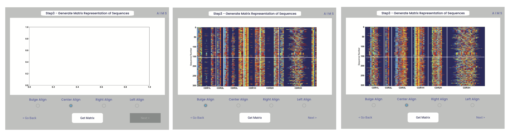

Congrats! You’ve generated your first piece of data using this software. You might notice that your image quality is poor for figures shown in the app, this is because the software shows *png files. Don’t worry, both a *png and a higher-quality *pdf version of the plot are saved in whichever directory you specified in Step 2.

**Step 4: Generate High-Dimensional Biophysical Matrix**

In this step, we generate the high-dimensional biophysical property matrix that will be used in all downstream analysis. We then have the option to include or exclude files from the clustering that will happen in the next step. If only one or two datasets are included in the analysis, all input data must be included in the clustering. Again, we simply press the “Generate Matrix” button, shown below, and then users can move on to the next step. 

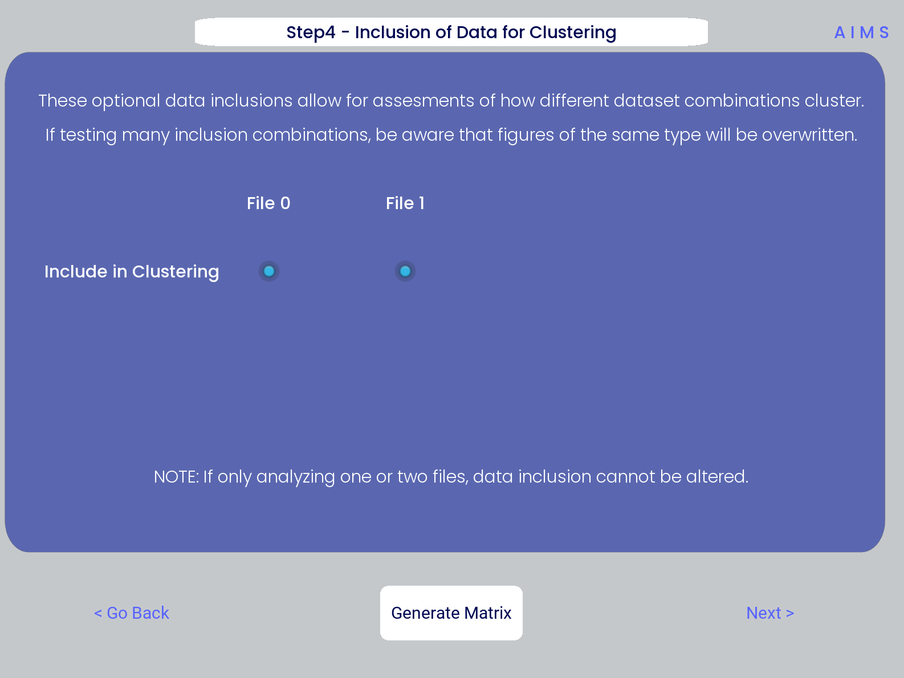

.. note::
   Don’t worry if this step takes a little while, especially for larger datasets

**Step 5: Dimensionality Reduction and Receptor Clustering**

The goal in this step is to take that large biophysical property matrix generated in the previous step, and reduce this high-dimensional matrix down to two or three composite dimensions, and then cluster the receptors projected onto this space based upon distance in this projected space. This step is perhaps the most involved in the GUI, with the most customizable options. First, the user must decide if they would like to reduce dimensionality on Net Average Properties, i.e. the biophysical properties averaged across entire receptors, or on the Position Sensitive Properties, i.e. the amino acid biophysical properties at every position on every receptor.

Next, the algorithm used for this dimensionality reduction must be chosen. Users can choose either Principal Component Analysis (PCA) or Uniform Manifold Approximation and Projection (UMAP), and additionally choose to visualize these projections in two- or three-dimensions. Once these options are chosen, click the "Reduce Dim" button to visualize these options. More options can be tested and the projection re-visualized as many times as the user desires.

Lastly, the data is then clustered using one of three algorithms, either K-Means, OPTICS, or DBSCAN clustering. Users must also define, for each of these algorithms, a tunable parameter that determines the size of the clusters generated. We can see each of these options, and the default values for the tunable parameters, in the screenshots below.

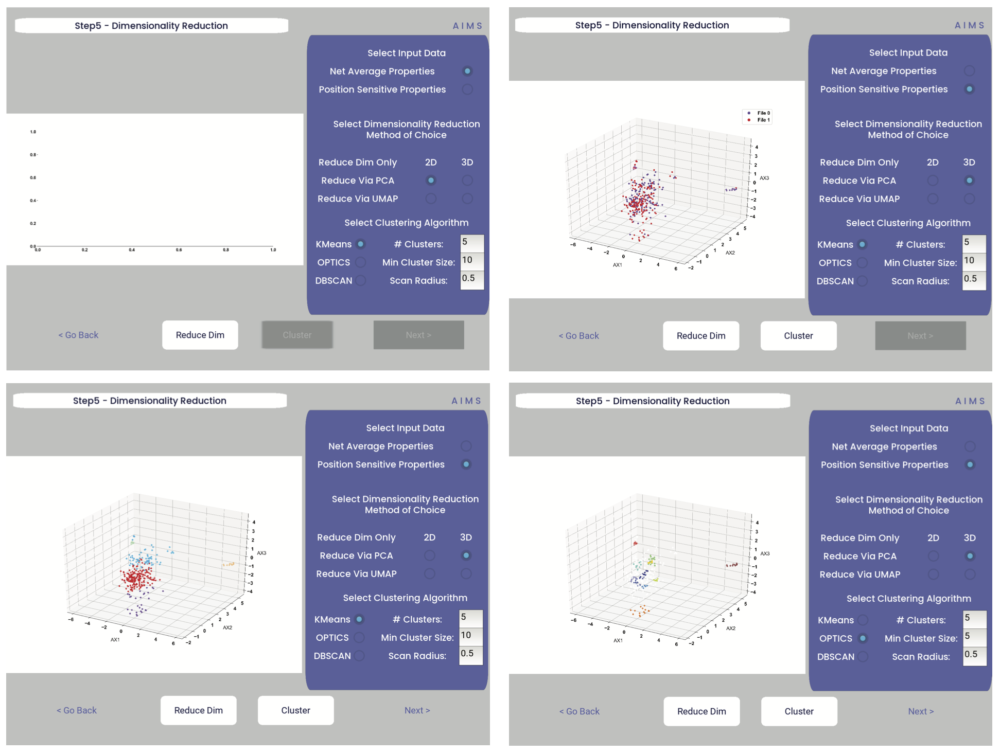

For more detail on how these dimensionality reduction and clustering algorithms work, as well as details on the tunable parameters, please see the :ref:`core`.

In the above screenshots, we see first the default screen (top left), then the three-dimensional PCA projection (top right), followed by a Kmeans clustering with 5 clusters (bottom left), and lastly an OPTICS clustering with a minimum cluster size of 5 (bottom right). Users should note that Kmeans will cluster all sequences in the dataset, while OPTICS and DBSCAN will exlude sequences that are not found at a sufficient density in the projection. These unclustered sequences are grayed out in the resultant displayed figure.

There is no one right answer to determining the "best" dimensionality reduction or clustering algorithm, so users are encouraged to try a range of options to determine which combination makes the most sense for their data.

.. note::
   Whichever projection and clustering algorithm the user is currently viewing when moving to the next step is what will be used in all downstream analysis

**Step 6: Visualize and Analyze Clustered Sequences**

At this stage, we visualize the clustered sequences from the previous step. First, the user must hit the "Visualize Cluster" button, then after visual inspection of the clusters and sequences, the "comparison clusters" can be selected. The goal of this step is to determine whether the user wants to compare two biophysically distinct clusters which were identified in the previous step, or compare across the input datasets. We can see in the screenshot below how this works:

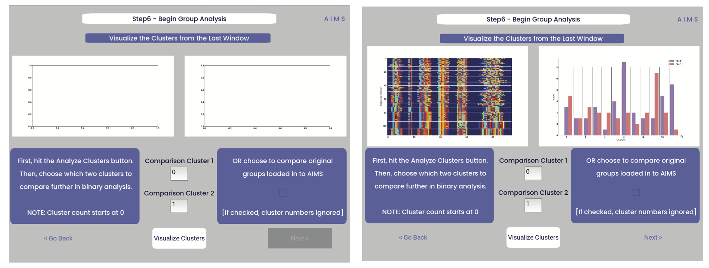

After the cluster visualization is complete, we see in the right panel, left figure that the matrix from step 3 is rearranged to reflect the clustered sequences, with higher sequence conservation (colors in the matrix) evident within each cluster. In the right figure, we see the sequence count of each input dataset in each cluster.

From this information, the user can determine which clusters they would like to analyze by entering values in the "Comparison Cluster" boxes. The cluster count starts at zero, and the user can infer the last cluster number from the figure on the right.

If the user instead is still most interested in comparing the input datasets, the checkbox on the right side of the screen can be checked, ignoring the clustering of the data (but still saving the results in the output directory!).

.. warning::
   The clustering algorithms are stochastic, and so cluster ID and cluster membership may change each time the software is run. For instance, in this walkthrough I use clusters 10 and 11 for downstream analysis, but users trying to replicate this analysis may have different sequences in clusters 10 and 11. This is important both for comparisons in this walkthrough as well as creating reproducible analysis.

**Step 7: Define Comparison Classes**

.. note::
   This screen is skipped when cluster analysis is chosen

Here, we separate our loaded data into separate classes for downstream analysis, assuming the user opted not to compare clustered sequences. As a default, each loaded dataset is assigned to its own unique group, but the user may group these datasets however they choose by assigning matching group numbers to datasets they want analyzed together. For the immmunoglobulin analysis, the cluster comparison option is chosen, so this screen is not shown. To see the comparison class definition screen, jump to Step 7 in the :ref:`AIMSmhc`.

.. warning::
   If comparing more than two distinct groups, some of the analysis will be unavailble. These analyses include mutual information analysis, amino acid frequency characterization, and linear discriminant analysis. Each of these analyses require binary classifications of the data.

**Step 8: Visualize Averaged Position Sensitive Biophysical Properties**

 In this step we look at average biophysical properties as a function of sequence space, part of our special “positional encoding”. At this stage in the walkthrough we won't bother showing the "before" snapshots of the GUI, as the only options are to press the button which generates the plot, and then move on to the next step. However, if you're trying to compare the results to the data we get in this walkthrough, the generated plots are quite useful:

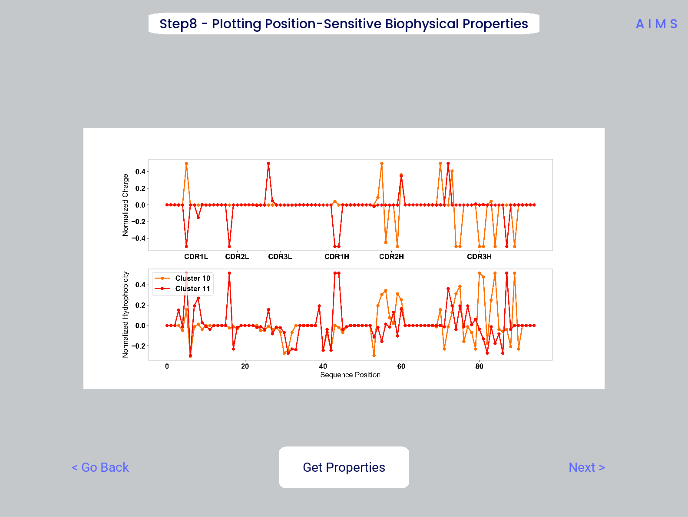

.. note::
   Standard deviations are not shown, and ideally these would be calculated via bootstrapping 

**Step 9: Visualize Raw Position Sensitive Biophysical Properties**

In this step, we visualize the position sensitive charge for all clones, not averaged. This figure can help provide a sense of how reliable the averages on the previous step are. Like all biophysical properties in AIMS, the charge is normalized, hence the minimum and maximum on the scales not equaling 1.

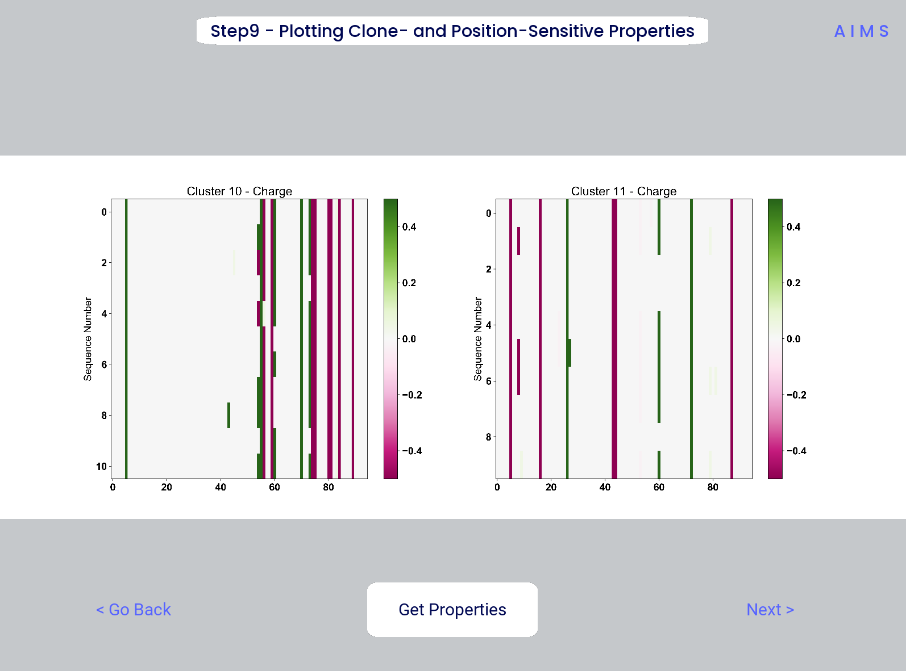

**Step 10: Visualize Net Biophysical Properties**

In this step, we are averaging the biophysical properties over all positions and all receptors.

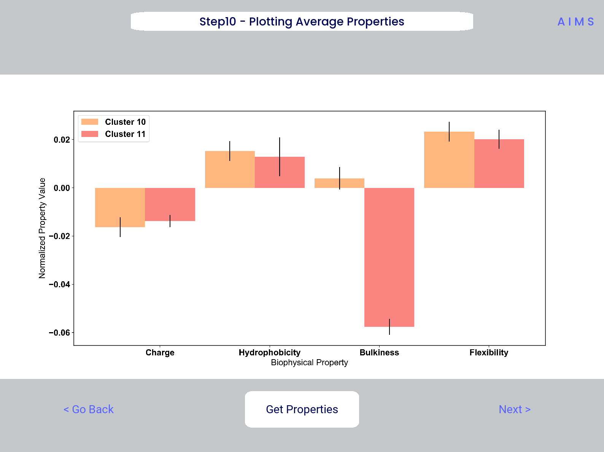

**Step 11: Calculate Shannon Entropy**

In this step, we are calculating the Shannon Entropy of the chosen datasets, effectively the diversity of the receptors as a function of position. For more information on the Shannon Entropy, as well as the Mutual Information discussed in the next step, view the Information Theory section of the :ref:`core`.

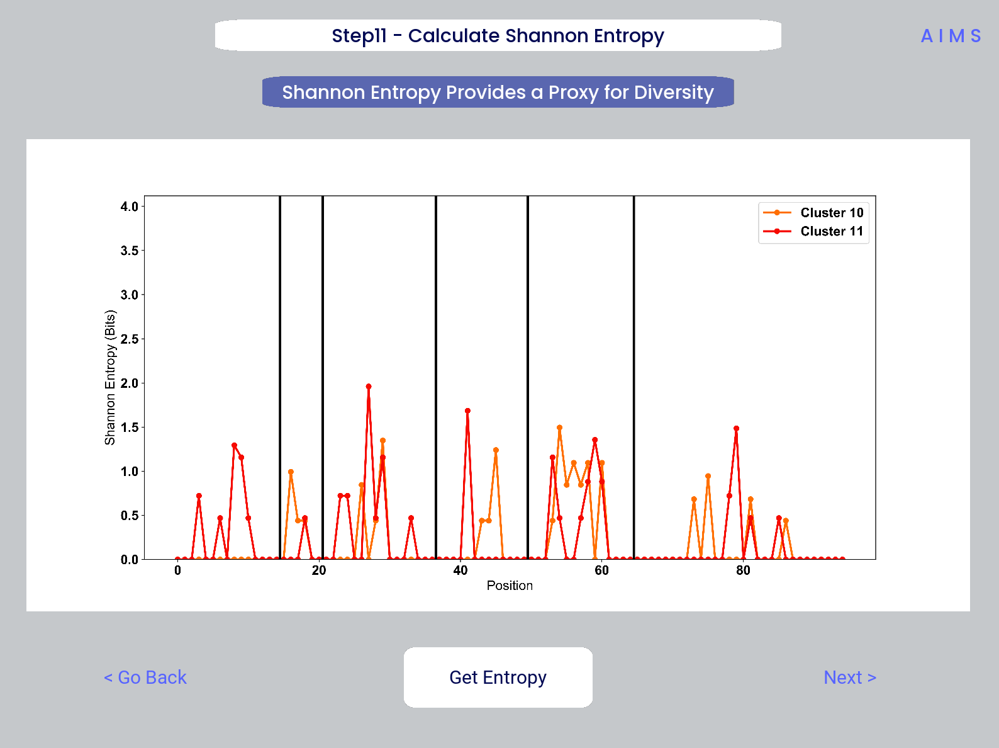

**Step 12: Calculate Receptor Mutual Information**

In this step, we calculate the mutual information between the individual posiitons in the AIMS matrix. The y-axis provides the "given" amino acid, and the x-axis provides the amount of information we gain at every other position given the amino acid identity at the "given" position. We present this data as a difference between the mutual information of group 1 and the mutual information of group 2. 

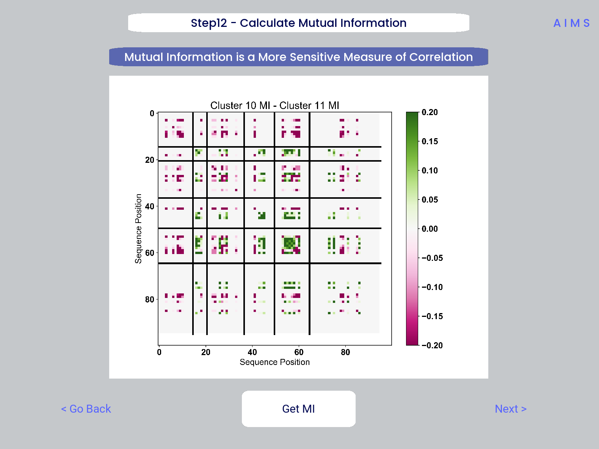

**Step 13: Visualize Amino Acid Frequencies**

Differences in frequencies, discuss what the colors mean.

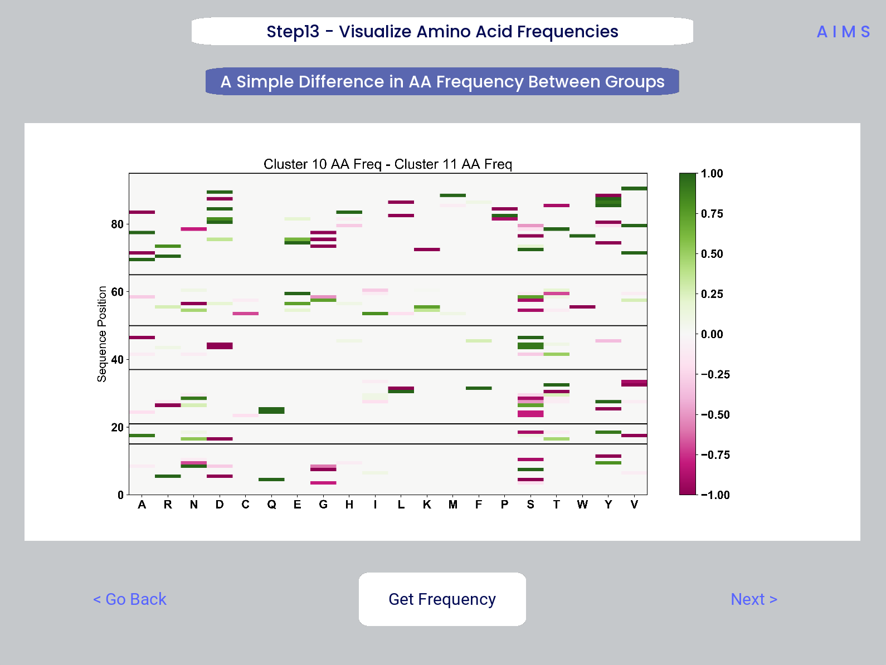

**Step 14: Linear Discriminant Analysis**

Linear discriminant analysis, be sure to say what is being discriminated. 

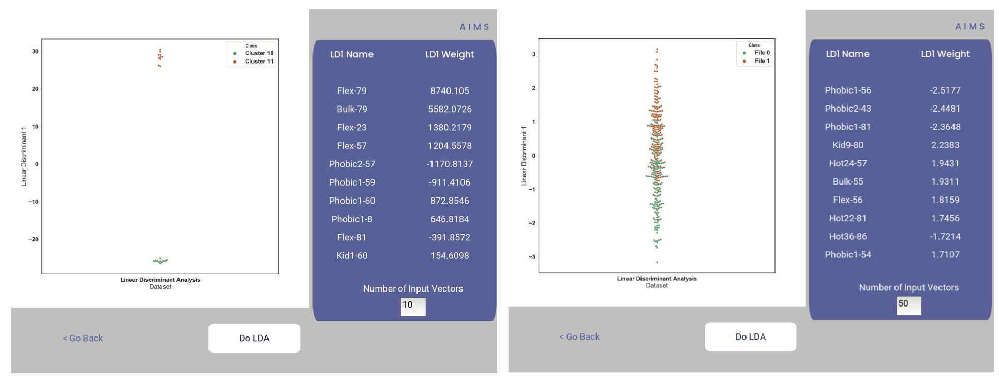

.. warning::
   Care must be taken not to overfit. If the number of input vctors is greater than the size of one of your datasets, you will overfit the data

For this example data, if we use 50 input vectors, we obtain a decent splitting of the data. The LD1 “names” and “weights” refer to the top ten weights that most strongly split the data. In other words, LDA tells you where the biggest differences are, positionally, in your dataset

.. _AIMSmhc:

MHC and MHC-Like Analysis with AIMS
------------
While a niche application of the software, AIMS readily extends to the analysis of any evolutionarily conserved molecules with specific regions of variability. MHC and MHC-like molecules fit very well into this category, and in the first published usage of AIMS, these moleclules were analyzed using the same tools as the immunoglobulin analysis. This section highlights the unique portions of the MHC analysis, and points out to where the analysis breaks down to become identical to the :ref:`AIMSig`.

**Step 1: Loading in Data**

FASTA files should be aligned sequences, with a minimum of 2 sequences per file, and a minimum of 2 FASTA files per program run. For the MHCs, formatting should just be in normal FASTA format. For following along with the analysis, load in “mhc_testData/“cd1_seqs.fasta”. 

**Step 2: Locate Helices and Strands**

So this is my least favorite part of the software, but it turns out this is the most efficient way to do things. Here, we explicitly say where in the alignments the strands/helices start. In an attempt to make this slightly less annoying, I’ve made it possible to create pre-formatted matrices for repeated analysis

For this example, from mhc_testData load in ex_cd1d_hla_uda_uaa_ji.csv. So for FASTA1, Strand 1 starts (S1s) at position 124, Strand 1 ends (S1e) at pos 167, Helix 1 starts (H1s) at this same position. And so on... Lastly, ”new_folder” is where output figures will be saved. Change this to whatever you want your folder name to be. Each run overwrites the figures, so maybe change to ”run1”, ”run2”, etc.

How do we locate helices and strands? NOTE, for this tutorial, this step has been done already
We first align molecules of interest within a single group
We then take a representative molecule (here human CD1d) and put it through our favorite structure prediction (Phyre, PsiPred, etc.)
When then go back and find where in the alignments a structural feature roughly begins
Here S1 starts at ”FPL” which occurs at alignment position 127. We add 3 amino acids of buffer space (optional, you can change this if you want) and you can see on the previous slide S1s = 124

Already figured out locations of Helices/Strands (based on provided FASTA files):
For the ji_cartFish we have: 2,49,93,152,193
For the cd1d_seqs.fasta we have: 124,167,209,262,303
For the hlaA_seqs.fasta we have: 170,218,260,306,348
For cd1_ufa_genes.fasta: 22,66,105,158,199
For UAA or UDA fasta: 2,49,93,152,193
In the future, I hope to identify these helices and strands automatically within the software, but I haven’t found anything suitable yet for doing so

**Step 3: Generate the Sequence Matrix**

On this window, you can just click “get matrix” to generate the matrix for this step. This matrix must be generated for subsequent steps to function properly

Congrats! You’ve generated your first piece of data using this software. You might notice that your image quality is poor for figures shown in the app, this is because the software shows *png files. Don’t worry, both versions of the plot are saved in whichever directory you specified in Step 2

**Step 4: Calculate Biophysical Properties**

Again, we simply press the “get properties” button. If a matrix was not generated in the previous window, then this step will fail. Don’t worry if this step takes a little while, especially for bigger data. The code needs a little work, but is accurate

Again, if you’re following along, you should see this exact plot once the calculation finishes. Plotted are average and standard deviations of these normalized biophysical properties. Each sequence has one value for each of these properties. i.e. flu_poly_sequence1 has charge = -0.01, hydrophobicity = 0.05, etc. (values made up)

**Step 5: Define Which Files to Group and Plot**

In this step, you can really take some freedoms and play around. What we are doing here is telling the software which groups we want to feed into the PCA analysis
Then, in the ”Plotted Group” section, we are letting the software know which groups will be shown on the resultant plot. Even if a group was used in the analysis, it doesn’t need to be plotted (and vice versa)

.. note:: 
   No options are given if only comparing two datasets. See MHC example for possibilities when there are three or more datasets.

**Step 6: Run and Plot PCA**

On this screen, we take the properties form step 4 and run a PCA on them
If you choose to exclude certain data from the PCA, but still plot it, then you are simply projecting that data onto the calculated principal component.

Along with a plot of the first 3 PCs, we also report the explained variance of these PCs, and the top 10 weights that make up PC1.
A 2D plot is also included in the saved figures.

**Step 7: Define Binary Classes**

Here, we separate our loaded data into binary classes for some machine-learning based analysis.

**Step 8: Generate Position Sensitive Biophysical Properties**

Whereas the biophysical properties of step 4 are averaged across entire molecules, we can instead average across our full molecular population. By doing so, we can look at average biophysical properties as a function of sequence space, part of our special “positional encoding”

We only show charge and hydrophobicity, but position sensitive data for all 62 properties are saved in the same directory as pdf figures.
.. note::
   Standard deviations are not shown, and ideally these would be calculated via bootstrapping 

**Step 9: Linear Discriminant Analysis**

Unlike PCA, linear discriminant analysis (LDA) is designed to split binary classes of data
Effectively, we can use it to find where the strongest differences in the data are

.. warning::
   Care must be taken not to overfit. If the number of input vctors is greater than the size of one of your datasets, you will overfit the data

For this example data, if we use 50 input vectors, we obtain a decent splitting of the data. The LD1 “names” and “weights” refer to the top ten weights that most strongly split the data. In other words, LDA tells you where the biggest differences are, positionally, in your dataset